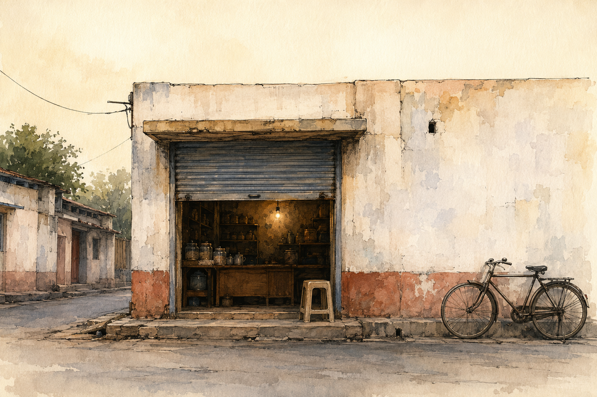

# Slides — Session 01: What Creativity Is, and Why Your Ideas Get Stuck

Unit 1 · Foundations of Creativity and Innovation · COs 109.1, 109.2

> Six slides. They serve the 15-minute input beat only — the session runs without them.

---

## 1. What Creativity Is, and Why Your Ideas Get Stuck  `HERO`

*SESSION 01*
What Creativity Is, and Why Your Ideas Get Stuck
Unit 1 · Foundations of Creativity and Innovation · 120 minutes · studio · COs 109.1, 109.2

> Speaker notes: Studio session. Warm-up: The Worst Possible Idea. Do not lecture past 15 minutes.

---

## 2. The one idea  `CONCEPT`

Creativity is having ideas. Innovation is an idea that actually reaches somebody. This course is about getting from the first to the second.

> Speaker notes: Say it once. Do not elaborate on the slide — elaborate out loud.

---

## 3. Why it matters  `FRAMEWORK`

- **The distinction** — A tea stall owner invents a new masala — that is creativity. Forty people a day buy it and come back — that is innovation.
- **Ideas have a lifecycle, and most die in the middle** — Between "I thought of it" and "someone used it" there is a long gap.

> Speaker notes: Four beats across two slides. Fifteen minutes for all of it.

---

## 4. What to do with it  `FRAMEWORK`

- **Four barriers, none about talent** — Judging too early. Fear of looking foolish. "We have always done it this way." The expertise trap.
- **These are predictable, so they are beatable** — That is the whole course.

> Speaker notes: Four beats across two slides. Fifteen minutes for all of it.

---

## 5. Today you will  `ACTIVITY`

Pick the one real business you are going to work on for the whole semester. Then write twenty questions you would need to ask its owner.
Marathi or Hindi · 60 minutes

> Speaker notes: Leave this slide up for the whole making phase.

---

## 6. To close  `KEY_TAKEAWAYS`

- **Pitch** — Three minutes. The person, the stuck, the idea, the picture, the ask.
- **Critique** — I like… / I wish… / What if… — the idea, never the person.
- **Idea log** — One page. Silent. Box 4 is the one you read again in week 15.

> Speaker notes: If time runs short, cut the input — never the pitch. The pitch is how CO 109.2 is attained.

---
