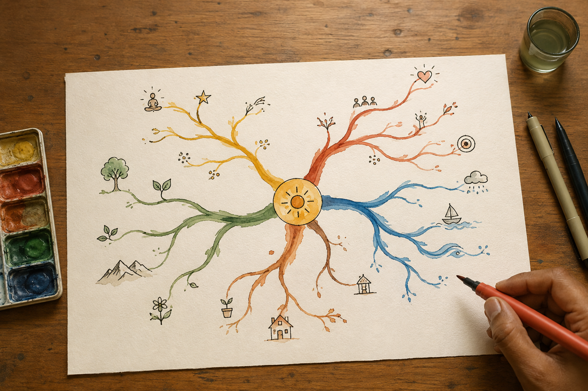

# Slides — Session 06: Mind Mapping — Buzan's Laws

Unit 2 · Mind Mapping and Creative Thinking Techniques · COs 109.4, 109.2

> Six slides. They serve the 15-minute input beat only — the session runs without them.

---

## 1. Mind Mapping — Buzan's Laws  `HERO`

*SESSION 06*
Mind Mapping — Buzan's Laws
Unit 2 · Mind Mapping and Creative Thinking Techniques · 120 minutes · studio · COs 109.4, 109.2

> Speaker notes: Studio session. Warm-up: Map Your Morning — With No Rules. Do not lecture past 15 minutes.

---

## 2. The one idea  `CONCEPT`

A list hides relationships. A Buzan map shows them — and the laws are what make the difference between a map and a doodle.

> Speaker notes: Say it once. Do not elaborate on the slide — elaborate out loud.

---

## 3. Why it matters  `FRAMEWORK`

- **Radiant thinking** — The brain does not store in lines; it radiates from a centre. A map on paper copies that shape, which is why recall improves.
- **The laws of emphasis** — A central image, not a word. Three colours minimum in that image. Branch thickness heaviest at the centre and thinning outward. Varying letter size.

> Speaker notes: Four beats across two slides. Fifteen minutes for all of it.

---

## 4. What to do with it  `FRAMEWORK`

- **The laws of clarity** — ONE key word per line. Print, do not join up. The word sits on the line. Line length equals word length. Curved branches, never straight rulered ones. Paper landscape.
- **Basic Ordering Ideas** — The main branches off the centre are your BOIs — the four to seven big buckets. Get those right and the rest of the map organises itself.

> Speaker notes: Four beats across two slides. Fifteen minutes for all of it.

---

## 5. Today you will  `ACTIVITY`

Draw a Buzan-compliant map of your anchor enterprise, twice.
Marathi or Hindi · 60 minutes

> Speaker notes: Leave this slide up for the whole making phase.

---

## 6. To close  `KEY_TAKEAWAYS`

- **Pitch** — Three minutes. The person, the stuck, the idea, the picture, the ask.
- **Critique** — I like… / I wish… / What if… — the idea, never the person.
- **Idea log** — One page. Silent. Box 4 is the one you read again in week 15.

> Speaker notes: If time runs short, cut the input — never the pitch. The pitch is how CO 109.2 is attained.

---
