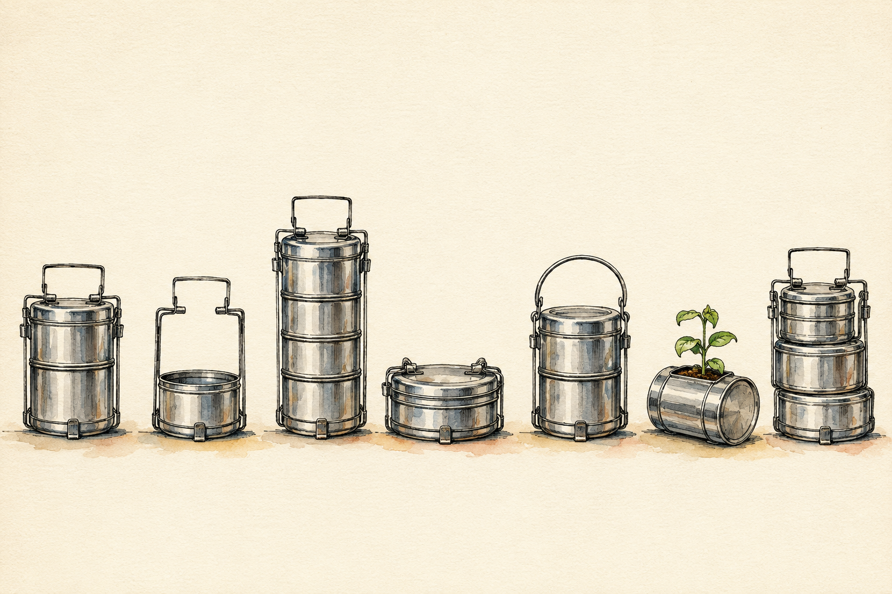

# Slides — Session 11: SCAMPER — Seven Ways to Change a Thing

Unit 3 · SCAMPER Technique for Innovation · COs 109.3, 109.2

> Six slides. They serve the 15-minute input beat only — the session runs without them.

---

## 1. SCAMPER — Seven Ways to Change a Thing  `HERO`

*SESSION 11*
SCAMPER — Seven Ways to Change a Thing
Unit 3 · SCAMPER Technique for Innovation · 120 minutes · studio · COs 109.3, 109.2

> Speaker notes: Studio session. Warm-up: Change the Chai. Do not lecture past 15 minutes.

---

## 2. The one idea  `CONCEPT`

SCAMPER is not inspiration. It is seven questions asked in order, and it works even on a day when you feel like you have no ideas.

> Speaker notes: Say it once. Do not elaborate on the slide — elaborate out loud.

---

## 3. Why it matters  `FRAMEWORK`

- **The seven prompts** — Substitute, Combine, Adapt, Modify, Put to another use, Eliminate, Rearrange.
- **Order matters less than completeness** — Running all seven badly beats running two well — the value is in coverage.

> Speaker notes: Four beats across two slides. Fifteen minutes for all of it.

---

## 4. What to do with it  `FRAMEWORK`

- **Eliminate is the most productive and the least used** — People add. Removing is where the surprises are.
- **Write before you judge** — Fill all seven rows first. Evaluate afterwards, never during.

> Speaker notes: Four beats across two slides. Fifteen minutes for all of it.

---

## 5. Today you will  `ACTIVITY`

Run all seven prompts on a physical object in this room, then on one you chose.
Marathi or Hindi · 60 minutes

> Speaker notes: Leave this slide up for the whole making phase.

---

## 6. To close  `KEY_TAKEAWAYS`

- **Pitch** — Three minutes. The person, the stuck, the idea, the picture, the ask.
- **Critique** — I like… / I wish… / What if… — the idea, never the person.
- **Idea log** — One page. Silent. Box 4 is the one you read again in week 15.

> Speaker notes: If time runs short, cut the input — never the pitch. The pitch is how CO 109.2 is attained.

---
